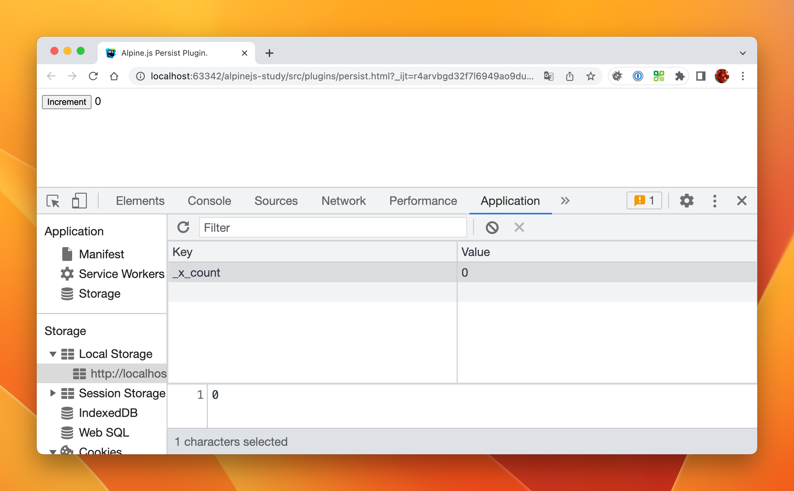
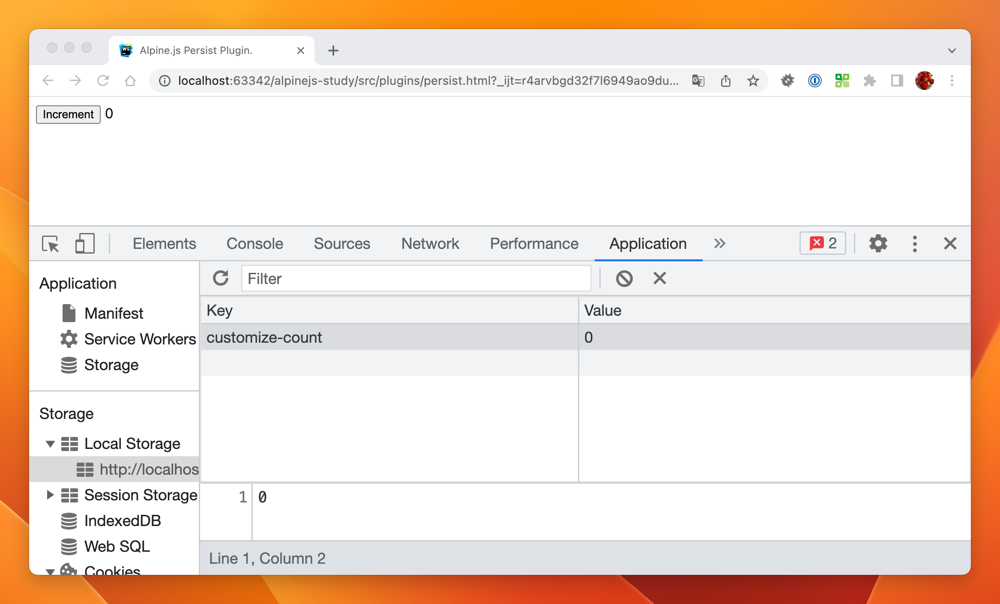

# Persist

Persist 插件允许在页面加载期间保持 Alpine 状态。

例如保留搜索过滤器、活动选项卡或者一些需要记录状态的功能很有用。

## 安装

跟 Alpine.js 的安装一样， Persist 插件同样支持从 `<script>` 脚本标签引用它或者将其作为模块导入。

### 通过 CDN 脚本


在 HTML 页面的头部包含以下 `<script>` 标签

```html
<html lang="en">
<head>
  <title>Alpine.js</title>
  <!--...-->
  <!-- Alpine Persist Plugins -->
  <script defer src="https://unpkg.com/@alpinejs/persist@3.x.x/dist/cdn.min.js"></script> // [!code focus]
  
  <script defer src="https://unpkg.com/alpinejs@3.x.x/dist/cdn.min.js"></script> // [!code focus]
</head>
<!--...-->
</html>
```

生产环境中，建议在链接中锁定特定版本号，以避免新版本中的变更造成问题。

例如，锁定版本为 3.10.5 (最新版本):

```html
<!-- Alpine Plugins -->
<script defer src="https://unpkg.com/@alpinejs/persist@3.10.5/dist/cdn.min.js"></script>
```


### 作为 NPM 模块

可以通过 `npm` / `yarn` 安装 Persist 并将其导入到一个包中。 运行以下命令来安装它：

::: code-group

```bash [yarn]
yarn add @alpinejs/persist
```

```bash [npm]
npm install @alpinejs/persist
```

:::

现在将 Mask 导入到包中并像这样初始化它：

```javascript
import Alpine from 'alpinejs'
import persist from '@alpinejs/persist' // [!code focus]
 
Alpine.plugin(persist) // [!code focus]
Alpine.start()
```

## $persist

使用此插件的主要 API 是 `$persist` 魔术方法。

可以像下面这样将任何值包装在 `x-data` 内部，让页面加载期间保留其值：

```html
<div x-data="{ count: $persist(0) }">
    <button x-on:click="count++">Increment</button>
  
    <span x-text="count"></span>
</div>
```

在上面的例子中，因为在 `$persist()` 中包裹 **0**，Alpine.js 现在将拦截所做的更改 `count` 并在页面加载时持久化它们。

可以通过在上面的示例中点击 `Increment` 按钮递增计数，然后刷新页面并观察计数值并没有重置为 **0**。

## 工作原理

如果一个值被包装在 `$persist` 中，在初始化时 Alpine.js 会为该值注册自己的观察者。

现在，每当该值因任何原因发生变化时，Alpine 都会将新值存储在 [localStorage](https://developer.mozilla.org/zh-CN/docs/Web/API/Window/localStorage) 中。

现在，当页面重新加载时，Alpine.js 将检查 [localStorage](https://developer.mozilla.org/zh-CN/docs/Web/API/Window/localStorage)（使用属性名称作为键）的值，如果找到一个将立即设置 [localStorage](https://developer.mozilla.org/zh-CN/docs/Web/API/Window/localStorage) 中的属性值。

可以通过打开浏览器开发者工具的 [localStorage](https://developer.mozilla.org/zh-CN/docs/Web/API/Window/localStorage) 查看器来观察此行为：



在开发者工具上会发现 Alpine.js 已经在 [localStorage](https://developer.mozilla.org/zh-CN/docs/Web/API/Window/localStorage) 中设置了 `count` 的值。

可以注意到它默认在 `count` 属性名称加上 `_x_` 前缀的命名方式，这样 Alpine.js 就不会与使用 [localStorage](https://developer.mozilla.org/zh-CN/docs/Web/API/Window/localStorage) 的其他工具发生冲突。

> `$persist` 适用于原始值以及数组和对象。但当变量的类型发生变化时，localStorage 必须被清除。
> 
> 在前面的示例中，如果将 `count` 的值更改为 `$persist({ value: 0 })`，则必须清除 localStorage 或重命名变量 `count`。

## 自定义键

默认情况下，Alpine.js 使用 `$persist(...)` 时会自动分配存储键。

当有多个跨页面甚至在同一页面上的多个 Alpine.js 组件，它们都使用 `count` 作为属性键，Alpine.js 将会无法区分这些组件。

在这些情况下，可以使用 **`.as`** 修饰符为任何持久值设置自己的自定义键，如下所示：

```html
<div x-data="{ count: $persist(0).as('customize-count') }">
    <button x-on:click="count++">Increment</button>
 
    <span x-text="count"></span>
</div>
```

现在 Alpine.js 将使用 `customize-count` 键存储和检索 `count` 值。



## 自定义存储

默认情况下，数据保存到 [localStorage](https://developer.mozilla.org/zh-CN/docs/Web/API/Window/localStorage)，它没有过期时间，即使页面关闭也会保留。

考虑希望在用户关闭页面后清除数据的场景。在这种情况下可以使用 `.using` 修饰符将数据持久化到 [sessionStorage](https://developer.mozilla.org/zh-CN/docs/Web/API/Window/sessionStorage)，如下所示：

```html
<div x-data="{ count: $persist(0).using(sessionStorage) }">
    <button x-on:click="count++">Increment</button>
 
    <span x-text="count"></span>
</div>
```

可以定义公开 `getItem` 函数和 `setItem` 函数的自定义存储对象。

例如可以决定使用 cookie 作为存储：

::: code-group
```html [HTML]
<div x-data="{ count: $persist(0).using(cookieStorage) }">
    <button x-on:click="count++">Increment</button>
 
    <span x-text="count"></span>
</div>
```

```javascript [JavaScript]
window.cookieStorage = {
    getItem(key) {
        let cookies = document.cookie.split(";");
        for (let i = 0; i < cookies.length; i++) {
            let cookie = cookies[i].split("=");
            if (key == cookie[0].trim()) {
                return decodeURIComponent(cookie[1]);
            }
        }
        return null;
    },
    setItem(key, value) {
        document.cookie = key+' = '+encodeURIComponent(value)
    }
}
```
:::


## 与 `Alpine.data()` 一起使用


如果 `$persist` 要配合 `Alpine.data` 使用，则需要使用标准函数而不是箭头函数，以便 Alpine.js 可以在最初评估组件范围时绑定自定义的 `this` 上下文。

```javascript
Alpine.data('dropdown', function () {
    return {
        open: this.$persist(false)
    }
})
```

## `Alpine.$persist()` 全局范围

`Alpine.$persist()` 应用在全局范围内，因此可以在 `x-data` 上下文之外使用。

这对于持久化来自其他来源，例如 `Alpine.store` 时可以使用。

```javascript
Alpine.store('darkMode', {
    on: Alpine.$persist(true).as('darkModeOn')
});
```